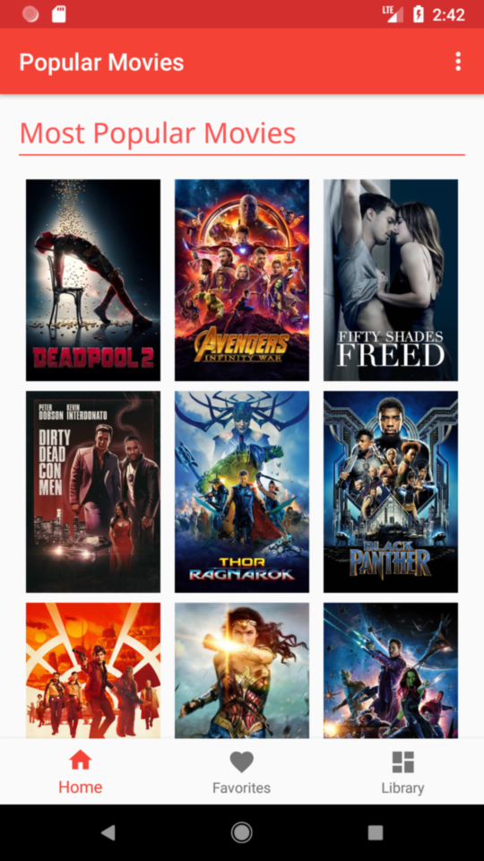

# Popular Movies
This is Android app displays popular movies and allows Users to sort movies by their popularity or their rating
# Installation
Download repository and import project into *Android Studio*. Before building the project, edit this [file](https://github.com/mkenlo/Popular-Movies/blob/master/app/src/main/java/com/mkenlo/popularmovies/utils/MoviesUtils.java) with a [TMDb API KEY](https://www.themoviedb.org)
# Preview

 

